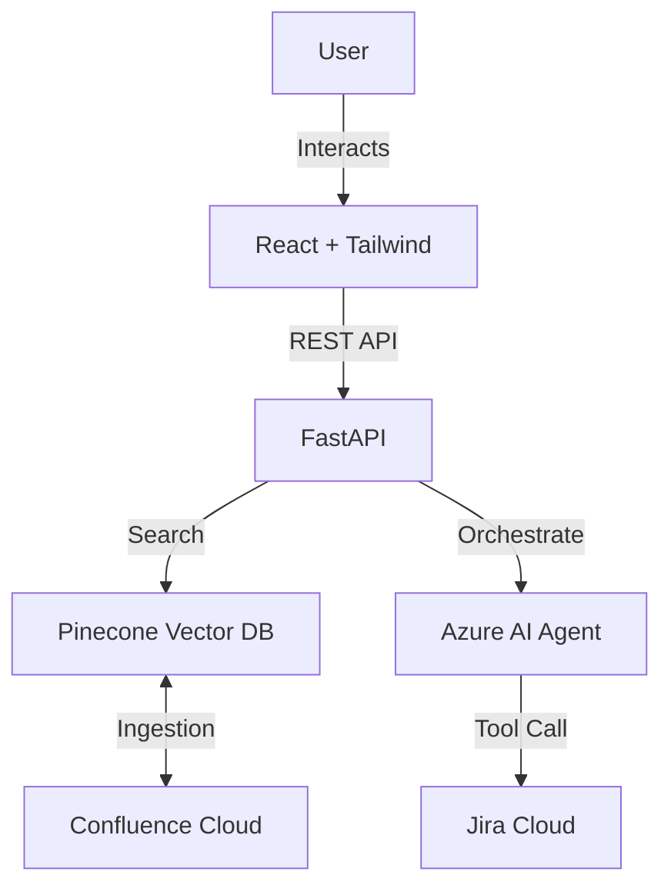

# 🚀 Hexa Agent Assistant
> **Intelligent Enterprise Support Agent** with Confluence Knowledge Base & Jira Automation.

Hexa Agent Assistant is a cutting-edge **Agentic AI application** designed to streamline enterprise support. It combines a modern, professional **React frontend** with a powerful **FastAPI backend**, employing **RAG (Retrieval-Augmented Generation)** to answer business queries from internal Confluence documentation and automatically raise **Jira tickets** when human intervention is needed.

---

## **📖 Overview**
In modern MNCs, employees waste hours searching for policies or filing tickets. **Hexa Agent** solves this by:
1.  **Ingesting** internal knowledge (Confluence pages) into a Vector Database.
2.  **Understanding** user queries via Azure AI Agents (GPT-4o).
3.  **Answering** questions instantly with citations.
4.  **Taking Action** by automatically creating Jira tickets if the issue isn't resolved.

---

## **✨ Key Features**

### **🤖 Agentic AI Ops**
*   **RAG-Powered Q&A:** Fetches real-time answers from Confluence documentation.
*   **Smart Fallback:** If the AI cannot solve the issue, it suggests raising a ticket.
*   **Azure AI Integration:** Orchestrated by Azure AI Foundry for robust agentic behavior.

### **⚡ Automated Workflows**
*   **Jira Integration:** The agent has a "tool" to create Jira tickets directly from the chat.
*   **Context-Aware:** Tickets include the conversation history and troubleshooting steps already attempted.

### **🖥️ Enterprise Frontend**
*   **Modern Aesthetics:** Clean, light-themed "MNC" design using **Tailwind CSS**.
*   **Role-Based Access:** Distinct flows for **End Users** (seeking help) and **Business Users** (admin/analytics).
*   **Interactive Chat:** Rich chat interface with smooth animations and typing indicators.

---

## **🏗️ Architecture**



---

## **⚡ Tech Stack**

### **Frontend**
*   **Framework:** React 18 (Vite)
*   **Styling:** Tailwind CSS, Lucide Icons, Framer Motion
*   **State:** React Hooks, React Router DOM
*   **HTTP Client:** Axios

### **Backend**
*   **Framework:** FastAPI (Python)
*   **Vector DB:** Pinecone
*   **AI/LLM:** Azure AI Foundry (GPT-4o-mini), Sentence Transformers (Local Embeddings)
*   **Integrations:** Atlassian (Confluence & Jira) API

---

## **🚀 Quick Start Guide**

### **1. Prerequisites**
*   Node.js 18+
*   Python 3.10+
*   **Accounts:** Azure AI Foundry, Pinecone, Atlassian (Jira/Confluence)

### **2. Backend Setup**
Navigate to the `backend` folder:
```bash
cd backend
python -m venv venv
# Windows:
.\venv\Scripts\activate
# Mac/Linux:
source venv/bin/activate

pip install -r requirements.txt
```

**Create a `.env` file** in `backend/` with the following:
```ini
# Confluence & Jira
EMAIL=your-email@company.com
API_TOKEN=your-atlassian-api-token
DOMAIN=your-domain.atlassian.net
PAGE_IDS=12345,67890

# Pinecone
PINECONE_API_KEY=your-pinecone-key
INDEX_NAME=agentic-hackathon-index

# Azure AI Foundry
AZURE_TENANT_ID=...
AZURE_CLIENT_ID=...
AZURE_CLIENT_SECRET=...
PROJECT_ENDPOINT=...
AZURE_AGENT_ID=...
```

Run the server:
```bash
uvicorn main:app --reload
```
*Backend runs on `http://localhost:8000`*

### **3. Frontend Setup**
Navigate to the `Frontend` folder:
```bash
cd Frontend
npm install
npm run dev
```
*Frontend runs on `http://localhost:5173`*

---

## **💡 Usage Workflow**
1.  **Login/Signup:** Create an account (End User or Business User).
2.  **Ask a Question:** E.g., *"What is the policy for remote work?"*
3.  **Get Answer:** The Agent searches Confluence and provides an answer.
4.  **Issue Resolution:**
    *   If answered, great!
    *   If not, say *"Create a ticket for this"*.
    *   The Agent will verify details and **actually create a Jira ticket** for you, returning the **Ticket Key** (e.g., `KAN-2`).

---

## **📂 Project Structure**
```
Agentic-Hackathon/
├── backend/
│   ├── core/           # Config & Pipelines
│   ├── routers/        # API Endpoints
│   ├── services/       # AI & Business Logic
│   └── main.py         # App Entry Point
│
├── Frontend/
│   ├── src/
│   ├── pages/          # Landing, Login, Signup, Chat
│   └── components/     # Reusable UI components
│
└── README.md
```

---

## **📝 License**
This project is part of the **Agentic AI Hackathon**. Created by [Your Name/Team].

---
© 2026 Hexa Agent Inc.
