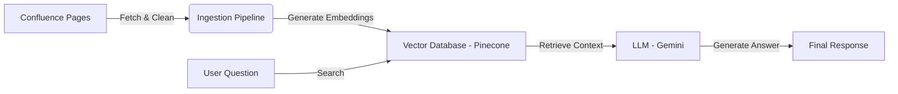

# 🤖 Agentic RAG System for Confluence

## **📖 Overview**
This project is an **Intelligent Support Agent** built for the Hackathon. It uses **RAG (Retrieval-Augmented Generation)** to turn your static Confluence documentation into an interactive, conversational AI assistant.

Instead of searching through endless wiki pages, users can simply ask: *"What is the eligibility criteria?"* and the Agent gives an instant, accurate answer based **only** on your approved business rules.

---

## **🏗️ System Architecture**

The system is built on three pillars: **Ingestion**, **Storage**, and **Retrieval**.



### **1. The Brain (LLM)**
*   **Model:** Google Gemini 2.0 Flash
*   **Role:** It acts as the reasoning engine. It takes the *facts* we give it and formulates a polite, human-readable answer. It does **not** hallucinate because we force it to use only the provided context.

### **2. The Memory (Vector Database)**
*   **Tech:** Pinecone
*   **Role:** Stores the "meaning" of your documents.
*   **How it works:** We convert text into numbers (Vectors). When a user asks a question, we convert that question into numbers too, and find the "mathematically closest" text in our database.

### **3. The Pipeline (Ingestion)**
*   **Tech:** Python, BeautifulSoup, Sentence-Transformers
*   **Role:** The bridge between Confluence and Pinecone. It fetches pages, strips out the HTML mess, chops them into small pieces, and saves them.

---

## **📂 Project Structure**

We have organized the code to be modular and production-ready:

```
E:\AGENTIC-HACKATHON\
│
├── src/                      # 🧠 The Core Logic
│   ├── config.py             # Central Configuration (API Keys, Settings)
│   ├── agent.py              # The Chatbot Script (Run this to talk)
│   └── pipeline.py           # The Data Loader (Run this to update data)
│
├── scripts/                  # 🛠️ Setup Tools
│   └── setup_db.py           # Resets/Creates the Pinecone Database
│
├── automation_history/       # 📜 Development Journey
│   ├── test.py               # First experiment with Confluence API
│   ├── test_gemini.py        # First experiment with Gemini API
│   └── ...                   # (See how we built this from scratch!)
│
├── data/                     # 📂 Local Files
│   └── (PDFs, etc.)
│
├── requirements.txt          # 📦 Dependencies
└── README.md                 # 📖 You are here
```

---

## **🚀 How to Run (Quick Start)**

### **Prerequisites**
*   Python 3.10+
*   API Keys for: Atlassian (Confluence), Pinecone, and Google Gemini.

### **Step 1: Install Libraries**
```bash
pip install -r requirements.txt
```

### **Step 2: Configure Credentials**
Open `src/config.py` and paste your keys (see the **Configuration Guide** below for details).

### **Step 3: Initialize Database**
Run this **once** to set up your Pinecone index:
```bash
python scripts/setup_db.py
```

### **Step 4: Ingest Knowledge**
Run this to read your Confluence pages and save them to the "Brain":
```bash
python -m src.pipeline
```

### **Step 5: Talk to the Agent**
Start the interactive chat:
```bash
python -m src.agent
```

---

## **⚙️ Configuration Guide (How to Use Your Own Data)**

To make this agent work with **your** company's data, you only need to edit **one file**: `src/config.py`.

### **1. Confluence Settings**
*   `EMAIL`: The email address you use to log in to Atlassian.
*   `DOMAIN`: Your company's domain (e.g., `acme-corp.atlassian.net`).
*   `API_TOKEN`: **Crucial.** Do not use your password.
    *   Go to: [https://id.atlassian.com/manage-profile/security/api-tokens](https://id.atlassian.com/manage-profile/security/api-tokens)
    *   Click **Create API Token**.
    *   Label it "AgenticHackathon" and copy the string.
*   `PAGE_IDS`: The specific pages you want the agent to read.
    *   *How to find ID:* Go to a Confluence page. Look at the URL. It usually looks like `.../pages/123456/Title`. The `123456` is your ID.

### **2. Pinecone Settings**
*   `PINECONE_API_KEY`: Sign up at [pinecone.io](https://www.pinecone.io/) (Free Tier).
*   `INDEX_NAME`: You can keep this as `agentic-hackathon-index`.

### **3. Gemini Settings**
*   `GEMINI_API_KEY`: Get it from [Google AI Studio](https://aistudio.google.com/).

---

## **🔍 Code Deep Dive (For Developers)**

### **`src/pipeline.py`**
This script performs the **ETL (Extract, Transform, Load)** process:
1.  **Extract**: Calls `requests.get()` to Confluence API.
2.  **Transform**:
    *   Uses `BeautifulSoup` to strip `<p>`, `<span>`, and `<div>` tags.
    *   Chunks text into 1000-character blocks (so we don't overwhelm the AI).
    *   Uses `SentenceTransformer('all-MiniLM-L6-v2')` to turn text into 384-dimensional vectors.
3.  **Load**: Pushes these vectors + metadata (original text) to Pinecone.

### **`src/agent.py`**
This is the runtime application:
1.  **Input**: User types a question.
2.  **Embedding**: We convert that question into a vector using the *same* model as the pipeline.
3.  **Semantic Search**: We ask Pinecone: *"Give me the 3 most similar text chunks to this question vector."*
4.  **Prompt Engineering**: We wrap those 3 chunks in a prompt:
    > "You are a helpful assistant. Use ONLY the following context to answer..."
5.  **Generation**: Gemini completes the prompt with the answer.

---

## **✅ Current Capabilities**
*   **Source-Aware**: The agent knows exactly which Confluence page the answer came from.
*   **Hallucination-Resistant**: If the answer isn't in the docs, it says "I don't know" instead of making things up.
*   **Secure**: It only accesses the pages you explicitly list in `PAGE_IDS`.
